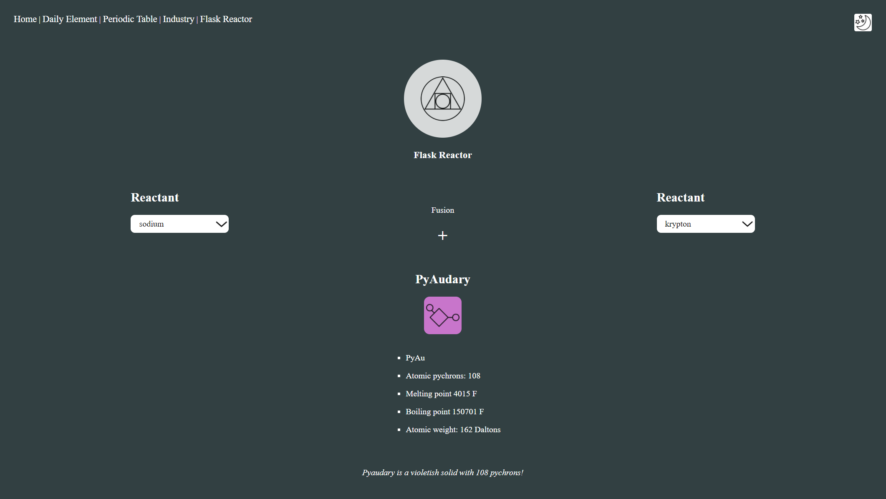

# Flask Reactor

💥🌛🪐🌌

Flask reactor has a built in reactor on the server to transmute elements with pychronium and provide the user with a newly created element.

Pychronium is an energy souce recovered from a recent supernove event in the andromeda galaxy, it absorbs reactant nucleii and transmutates all subatomic particles into pychron.

The web site has automated scripts to provide a daily randomized element from the periodic table as well as current international news from the chemicals industry using a built in web scraper with beautiful soup!

**Click moon for dark mode.**

